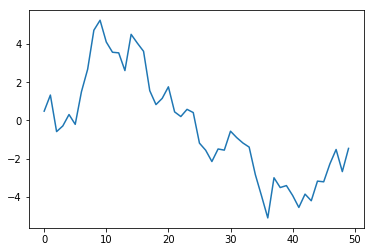

# <center>Python语言基础、Ipython及Jupyter Notebook</center>

## Python解释器

- Python是一种解释性语言。Python解释器通过一次执行一条语句来运行程序、
- exit()或者Ctrl+D退出
- 推荐使用IPython或者Jupyter notebook
- IPython中使用`%run`命令运行程序

## IPython基础

### 运行IPython命令行

```python
Python 3.6.5 |Anaconda, Inc.| (default, Mar 29 2018, 13:32:41) [MSC v.1900 64 bit (AMD64)]
Type 'copyright', 'credits' or 'license' for more information
IPython 6.4.0 -- An enhanced Interactive Python. Type '?' for help.

In [1]:
```


```python
a = 5
a
```


    5


```python
import numpy as np
data = {i:np.random.randn() for i in range(7)}
data
```


    {0: -0.5674396424169679,
     1: 0.19050981699462938,
     2: -2.0149446135013487,
     3: 1.5352032518130372,
     4: 0.642189294281483,
     5: 0.00028053900205991876,
     6: 0.15282591190295522}


### 运行Jupyter Notebook

- 在命令行输入`jupyter notebook`即可

### Tab键补全

- 在命令行输入表达式时，按下`Tab`可以为任何变量(对象、函数)搜索命名空间  
- IPython中可以，Jupyter Notebook中需要另行设置


```python
an_apple = 27
an_example = 42
an_apple
```


    27


```python
b = [1,2,3]
b.append(4)
```


```python
import datetime 
datetime.date
```


    datetime.date


- Tab键在上下文场景中同样适用，输入任意路径时按下`Tab`键建表补全计算机文件系统中的匹配内容。
- 与%run命令搭配使用
- 函数的关键字参数中节约时间

### 内省

在一个变量名前后使用问号(?)查看该对象的概要信息。  
IPython和Jupyter Notebook均显示  
这就是对象内省，如果对象是一个函数或者实例方法且在文档中已经写好，则文档字符串会显示出来。


```python
b?
```


```python
?print
```


```python
def add_numbers(a, b):
    """
    Add two numbers together
    Returns
    -------
    the_sum : type of anrguments
    """
    return a+b
```


```python
add_numbers?
```


```python
add_numbers??
```


```python
# Jupyter Notebook中不支持
np.*load*?
```

1. 使用一个`?`来显示文档字符串(可以是自己创建的)  
2. 使用双问号`??`可以显示函数的源代码
3. `?`可以搜索IPython命名空间,与其它字符和通配符组合在一起，会显示所有匹配通配符表达式的命名。

### %run命令


```python
%run ipython_script_test.py
```


```python
c
```


    7.5


```python
result
```


    1.4666666666666666


- 脚本是在空白的命名空间(没有导入模块和其他的定义变量)中运行的与命令行直接运行结果相同。  
- 文件中定义的所有变量(导入的、函数中的、全局定义的)在运行之后可以在IPython命令行中使用。  
- 若要提供命令行参数，则需要在文件路径后面加上参数传递。
- 如果要让代运行的脚本在使用IPython命名空间中已有的变量，使用`%run -i`。
- 在Jupyter notebook中,使用`%load`魔术函数将脚本导入一个代码单元。


```python
# %load ipython_script_test.py
def f(x, y, z):
    return (x+y)/z

a = 5
b = 6
c = 7.5

result = f(a, b, c)

```

#### 中断运行的代码

在任意代码运行时按下`Ctrl + C`即可。<br>
异常情况只能强制结束Python进程。

### 执行剪贴板中的程序

在执行Jupyter notebook时可以将代码复制粘贴到代码单元然后运行，而IPython中可以直接运行剪贴板中的程序。
- %paste 获得剪贴板中的所有文本，并在命令行中作为一个代码块执行。
- %cpaste 给出一个提示符，用来粘贴代码，粘贴完毕时使用`--`或者`Ctrl + D`退出，`Ctrl + C`用来中断提示符。

```python
x = 5
y = 7
if x > 5:
    x += 1
    
    y = 8
```

```python
In [1]: %paste
x = 5
y = 7
if x > 5:
    x += 1
    
    y = 8
## -- ENd pasted text --
```

```python
In [18]: %cpaste
Pasting code; enter '--' alone on the line to stop or use Ctrl-D.
:x = 5
:y = 7
:if x > 5:
:    x += 1
:
:    y = 8
:--
```

### 终端快捷键

#### 标准IPython快捷键列表

|快捷键 | 描述 |
|:-|:-|
|Ctrl+P 或 向上箭头|从当前内容开始向后搜索历史命令|
|Ctrl+N 或 向下箭头|从当前内容开始向前搜索历史命令|
|Ctrl+R|按行读取的反向历史记录(部分匹配)|
|Ctrl+Shift+V|从剪贴板粘贴文本|
|Ctrl+C|中断当前正在执行的代码|
|Ctrl+A|将光标移动到本行起始位置|
|Ctrl+E|将光标移动到本行结束位置|
|Ctrl+K|删除光标后本行的所有内容|
|Ctrl+U|删除当前行|
|Ctrl+F|将光标向前移动一个字符|
|Ctrl+B|将光标向后移动一个字符|
|Ctrl+L|清除本屏内容|

### 关于魔术命令

1. IPython的特殊命令，简化常见任务。前缀符号是`%`  
2. 魔术命令可以看做是IPython系统内部的命令行程序，大多数可以使用`?`来查看额外的“命令行”选项。
3. 没有变量定义为与魔数函数相同的名字时可以不加`%`直接使用魔术命令，称为自动魔术，通过`%automagic`进行启用/禁用关。
4. 魔术命令的输出可以赋值给一个变量

- %timeit  检查一段Python语句的执行时间
- %pwd     显示当前文件路径
- %automagic 自动魔术是否开启
- %quickref %magic 探索所有的特殊命令

```python
In [6]: import numpy as np

In [7]: a = np.random.randn(100,100)

In [8]: %timeit np.dot(a, a)
110 µs ± 15.5 µs per loop (mean ± std. dev. of 7 runs, 1 loop each)
```

```python
In [9]: %debug?
Docstring:
::

  %debug [--breakpoint FILE:LINE] [statement [statement ...]]

Activate the interactive debugger.

This magic command support two ways of activating debugger.
One is to activate debugger before executing code.  This way, you
can set a break point, to step through the code from the point.
You can use this mode by giving statements to execute and optionally
a breakpoint.

The other one is to activate debugger in post-mortem mode.  You can
activate this mode simply running %debug without any argument.
If an exception has just occurred, this lets you inspect its stack
frames interactively.  Note that this will always work only on the last
traceback that occurred, so you must call this quickly after an
exception that you wish to inspect has fired, because if another one
occurs, it clobbers the previous one.

If you want IPython to automatically do this on every exception, see
the %pdb magic for more details.

positional arguments:
  statement             Code to run in debugger. You can omit this in cell
                        magic mode.

optional arguments:
---Return to continue, q to quit---
```

```python
In [10]: %pwd
Out[10]: 'D:\\PythonCourse\\Jupyter Notebook\\Book\\Python for Data Analysis\\chap02'

In [11]: foo = %pwd

In [12]: foo
Out[12]: 'D:\\PythonCourse\\Jupyter Notebook\\Book\\Python for Data Analysis\\chap02'
```

```python
In [13]: %magic

IPython's 'magic' functions
===========================

The magic function system provides a series of functions which allow you to
control the behavior of IPython itself, plus a lot of system-type
features. There are two kinds of magics, line-oriented and cell-oriented.

Line magics are prefixed with the % character and work much like OS
command-line calls: they get as an argument the rest of the line, where
arguments are passed without parentheses or quotes.  For example, this will
time the given statement::

        %timeit range(1000)

Cell magics are prefixed with a double %%, and they are functions that get as
an argument not only the rest of the line, but also the lines below it in a
separate argument.  These magics are called with two arguments: the rest of the
call line and the body of the cell, consisting of the lines below the first.
For example::

        %%timeit x = numpy.random.randn((100, 100))
        numpy.linalg.svd(x)

will time the execution of the numpy svd routine, running the assignment of x
as part of the setup phase, which is not timed.

In a line-oriented client (the terminal or Qt console IPython), starting a new
input with %% will automatically enter cell mode, and IPython will continue
---Return to continue, q to quit---
```

```python
In [14]: %quickref

IPython -- An enhanced Interactive Python - Quick Reference Card
================================================================

obj?, obj??      : Get help, or more help for object (also works as
                   ?obj, ??obj).
?foo.*abc*       : List names in 'foo' containing 'abc' in them.
%magic           : Information about IPython's 'magic' % functions.

Magic functions are prefixed by % or %%, and typically take their arguments
without parentheses, quotes or even commas for convenience.  Line magics take a
single % and cell magics are prefixed with two %%.

Example magic function calls:

%alias d ls -F   : 'd' is now an alias for 'ls -F'
alias d ls -F    : Works if 'alias' not a python name
alist = %alias   : Get list of aliases to 'alist'
cd /usr/share    : Obvious. cd -<tab> to choose from visited dirs.
%cd??            : See help AND source for magic %cd
%timeit x=10     : time the 'x=10' statement with high precision.
%%timeit x=2**100
x**100           : time 'x**100' with a setup of 'x=2**100'; setup code is not
                   counted.  This is an example of a cell magic.

System commands:

!cp a.txt b/     : System command escape, calls os.system()
cp a.txt b/      : after %rehashx, most system commands work without !
---Return to continue, q to quit---
```

IPython常用魔术命令


|命令|描述|
|:-|:-|
|%quickref|显示IPython的快速参考卡|
|%magic|显示所有可用魔术命令的详细文档|
|%debug|从最后发生报错的底部进入交互式调试器|
|%hist|打印命令输入(也可以打印输出)历史|
|%pdb|出现任意报错后自动进入调试器|
|%paste|从剪切板中执行已经预先格式化的Python代码|
|%cpaste|打开一个特殊提示符，手动粘贴待执行的Python代码|
|%reset|删除交互式命名空间中所有的变量、名称|
|%page OBJECT|通过分页器更美观地打印显示一个对象|
|%run script.py|在IPython中运行一个Python脚本|
|%prun statement|使用CProfile执行语句，并报告输出|
|%time statement|报告单个语句的执行时间|
|%timeit statement| 多次执行单个语句计算平均执行时间；在估算代码最短执行时间时有用|
|%who %who_ls %whos|根据不同级别的信息/详细程度，展示交互命名空间中定义的变量|
|%xdel variable|在IPython内部删除一个变量，清除相关的引用|

### matplotlib集成

`%matplotlib`魔术命令可以设置matplotlib与IPython命令行或Jupyter notebook的集成。
- 在Ipython命令行中，运行`%matplotlib`可以生成多个绘图窗口，额如需干扰控制台的会话。
- 在Jupyter notebook中，运行`%matplotlib inline`。

```python
In [19]: %matplotlib
Using matplotlib backend: Qt5Agg
```


```python
%matplotlib inline
```


```python
import matplotlib.pyplot as plt
import numpy as np

plt.plot(np.random.randn(50).cumsum())
```


    [<matplotlib.lines.Line2D at 0x24b29750b00>]





## Python语言基础

### 语言语义

#### 缩进，而不是大括号

1. Python使用缩进来组织代码,一个冒号代表一个缩进代码块的开始，单个代码块中所有的代码必须保持相同的缩进直到代码块结束。  
2. 推荐使用四个空格来使用缩进。
3. Python中可以使用分号在一行内经多条语句进行分隔,但是不推荐使用。

```python
for i in array:
    if x < pivot:
        less.append(x)
    else:
        great.append(x)
```

```python
a = 5; b = 6; c = 7
```

#### 一切皆为对象

Python中每一个数值、字符串、数据结构、函数、类、模块以及所有存在于Python解释器中的事物都是Python对象。每个对象都会关联到一种类型(例如字符串、函数)和内部数据。

#### 注释

- 使用`#`在代码块中添加注释。
- 注释也可以写在一行被执行代码的后面。

```python
result = []
for line in file_handle:
    # 当前保持行为空
    # if len(line) == 0
    #   则继续
    result.append(line.replace('foo', 'bar'))
```

```python
print('Reached this line')    # 简单的状态报告
```

#### 函数和对象方法的调用

- 调用函数时，向函数括号中传递0或多个参数，通常会把返回值赋给一个变量。
- 几乎所有的Python对象都有内部函数，称之为方法。
- 函数传参可以是位置参数，也可以是关键字参数。

```python
reslut = f(x, y, z)
g()
```

```python
obj.aome_method(x, y, z)

result = f(a, b, c, d=5, e='foo')
```

#### 变量和参数传递

- 在Python中虽一个变量(或者变量名)赋值时，就创建了一个指向等号右边对象的引用。
- 当将对象作为参数传递给函数时，指向原始对象的新的本地变量就会被创建而无需复制。即如果将一个新的对象绑定到一个函数内部的变量上，这种变更不会在上级范围中产生影响。因此，更换可变阐述的内部直是可以做到的。

```python
# 实际上a和b指向的是同一个对象

In [22]: a = [1,2,3]

In [23]: b = a

In [24]: a.append(4)

In [25]: b
Out[25]: [1, 2, 3, 4]

In [26]: a
Out[26]: [1, 2, 3, 4]
```

```python
In [27]: def append_element(some_list, element):
    ...:     some_list.append(element)
    ...:

In [28]: data = [1, 2, 3]

In [29]: append_element(data, 4)

In [30]: data
Out[30]: [1, 2, 3, 4]
```

#### 动态引用，强类型

- Python中对象引用不涉及类型。
- 变量对于对象来说只是特定命名空间中的名称，类型信息是存储在对象自身之外的。
- 所有的对象都拥有一个指定的类型(或类)，隐式转换只在某些特定的、明显的情况下发生。
- `isinstance`函数用来检查一个对象是否是特定类型的实例。

```python
In [31]: a = 5

In [32]: type(a)
Out[32]: int

In [33]: a = 'foo'

In [34]: type(a)
Out[34]: str
```


```python
'5' + 5
```


    ---------------------------------------------------------------------------

    TypeError                                 Traceback (most recent call last)

    <ipython-input-8-4dd8efb5fac1> in <module>()
    ----> 1 '5' + 5
    

    TypeError: must be str, not int


```python
a = 4.5
b = 2
# String formatting, to be viisited later
print('a is {0}, b is {0}'.format(type(a), type(b)))
a / b
```

    a is <class 'float'>, b is <class 'float'>
    


    2.25


```python
a = 5
isinstance(a, int)
```


    True


```python
# isinstance接受一个包含类型的元组。

In [35]: a = 5; b = 4.5

In [36]: isinstance(a, (int, float))
Out[36]: True

In [37]: isinstance(b, (int, float))
Out[37]: True
```

#### 属性和方法

- Python中的对象通常会有属性和方法，均通过`obj.attribute_name`的方式调用。
- 属性和方法可以通过`getattr`方法获得


```python
a = 'foo'
getattr(a, 'split')
```


    <function str.split>


#### 鸭子类型

- 使用`iter`函数验证一个对象是否实现了迭代器对象。
- 对于绝大多数的Python容器类型的对象，`iter`函数都会返回True。


```python
def isiterable(obj):
    try:
        iter(obj)
        return True
    except TypeError:   # not iterable
        return False
```


```python
print(isiterable('a string'))
print(isiterable([1, 2, 3]))
print(isiterable(5))
```

    True
    True
    False
    


```python
# 先检查对象是否是一个列表(NumPy数组)，不是则将其转换为一个列表

if not isinstance(x, list) and isiterable(x):
    x = list(x)
```

#### 导入

- Python中模块就是以`.py`为后缀名并且包含Python代码的文件。


```python
# %load some_module.py
# some_module.py
PI = 3.14159

def f(x):
    return x + 2

def g(a,b):
    return a + b

```


```python
import some_module
result = some_module.f(5)
pi = some_module.PI
print(result, pi)
```

    7 3.14159
    


```python
from some_module import f, g, PI
result = g(5, PI)
print(result)
```

    8.14159
    


```python
# 通过as关键字给导入的内容不同的变量名
import some_module as sm
from some_module import PI as pi, g as gf

r1 = sm.f(pi)
r2 = gf(6, pi)
print(r1, r2)
```

    5.14159 9.14159
    

#### 二元运算符和比较运算

- `is`关键字检查两个关键字是否指向同一个对象，`is not`同样有效。
- `list`函数总是创建一个新的Python列表(即一份拷贝),
- `==`是检查对象的内容是否相同，`is`是检查是否是同一个对象。

```python
In [38]: 5 - 7
Out[38]: -2

In [39]: 12 + 21.5
Out[39]: 33.5

In [40]: 5 <= 2
Out[40]: False
```

```python
In [41]: a = [1, 2, 3]

In [42]: b = a

In [43]: c = list(a)

In [44]: a is b
Out[44]: True

In [45]: a is not c
Out[45]: True
```

```python
In [46]: a == c
Out[46]: True

In [47]: a is None
Out[47]: False

In [48]: a = None

In [49]: a is None
Out[49]: True
```

二元操作符

|操作符|描述|
|:-|:-|
|a + b|a加b|
|a * b|a乘b|
|a / b|a除以b|
|a // b|a整除以b|
|a ** b|a的b次方|
|a & b|a与b，对于整数则是按位AND|
|a \| b|a或b，对于整数则是按位OR|
|a ^ b|对布尔值，a异或b，对整数则是按位异或|
|a == b|a和b相等则为True|
|a != b|a和b不相等则为True|
|a <= b, a < b|小于等于，小于|
|a > b, a >= b|大于，大于等于|
|a is b|a和b是同一个Python对象则为True|
|a is not b|a和b不是同一个Python对象则为True|

#### 可变对象和不可变对象

- Python中的大部分对象，如列表，字典，Numpy对象是可变对象，大多数用户定义的类型(类)也是可变的。可变对象中包含的对象和值是可以被修改的。
- Python中的字符串和元组等式对象是不可变的。

```python
In [50]: a_list = ['foo', 2, [4, 5]]

In [51]: a_list[2]
Out[51]: [4, 5]

In [52]: a_list
Out[52]: ['foo', 2, [4, 5]]
```

```python
In [53]: a_tuple = (3, 5, (4, 5))

In [54]: a_tuple[1] = 'four'
---------------------------------------------------------------------------
TypeError                                 Traceback (most recent call last)
<ipython-input-54-23fe12da1ba6> in <module>()
----> 1 a_tuple[1] = 'four'

TypeError: 'tuple' object does not support item assignment
```

### 标量类型

标准python标量类型

|类型|描述|
|:-|:-|
|None|Python的null值，只存在一个实例|
|str|字符串类型，包含Unicode(UTF-8编码)字符串|
|bytes|原生ASCII字节(或者Unicode编码字节)|
|float|双精度64位浮点数值(注意没有独立的double类型)|
|bool|True或Flase|
|int|任意精度无符号整数|

#### 数值类型

- 基础的Python数字类型就是`int`和`float`。`int`可以存储任意大小的数字。
- 浮点数在Python中用`float`表示，每一个浮点数都是双精度64位数值。
- 整数除法会将结果自动转型为浮点数。
- `//`为整数操作符


```python
ival = 17239871
ival ** 6
```


    26254519291092456596965462913230729701102721


```python
fval = 7.243
fval2 = 6.78e-5
```


```python
print(3 / 2)
print(3 // 2)
```

    1.5
    1
    

#### 字符串

- 可以使用单引号`'`或者`"`写一个字符串字面值
- 对于有换行的多行字符串，使用三个单引号`'''`，或者三个双引号`"""`
- Python中的字符串无法修改
- 字符串是Unicode字符的序列，可以被看做是除了列表和元组之外的另外一种序列。
- `s[:3]`这种写法叫做切片
- 反斜杠符号`\`是转义符号，用来指明特殊的含义。
- 在字符串前面加上一个`r`代表这是一个原生字符串。(raw)
- 字符串格式化[官方文档](https://docs.python.org/3.6/library/string.html)


```python
a = 'one way of writing a string'
b = 'another way'

c = """
This is a longer string that
spans multiple lines
"""
```


```python
# 计算字符串c的换行符
c.count('\n')
```


    3


```python
In [55]: a = 'this si a string'

In [56]: a[10] = 'f'
---------------------------------------------------------------------------
TypeError                                 Traceback (most recent call last)
<ipython-input-56-2151a30ed055> in <module>()
----> 1 a[10] = 'f'

TypeError: 'str' object does not support item assignment
```

```python
In [57]: a = 5.6

In [58]: s = str(a)

In [59]: print(type(s))
<class 'str'>

In [60]: s = 'python'

In [61]: list(s)
Out[61]: ['p', 'y', 't', 'h', 'o', 'n']

In [62]: s[:3]
Out[62]: 'pyt'
```


```python
s = '12\\34'
print(s)
s = r'this\has\no\special\characters'
print(s)

a = 'this is the first half '
b = 'and this si the second half'
print(a + b)
```

    12\34
    this\has\no\special\characters
    this is the first half and this si the second half
    


```python
# 字符串格式化
# {0:.2f}表示将第一个参数格式化为2位小数的浮点数
# {1:s}表示将第二个参数格式化为字符串
# {2:d}表示将第三个参数格式化为整数

template = '{0:.2f} {1:s} are worth US${2:d}'
print(template.format(4.5560, 'Argentine Pesos', 1))
```

    4.56 Argentine Pesos are worth US$1
    

#### 字节与Unicode

- Python3中Unicode成为字符串类型的一等类，用于更好的兼容处理文本。
- `encode()`方法将这个Unicode字符串换成UTF-8字节
- `decode()`方法用于一个字节对象的Unicode编码的解码


```python
val = "español"
val
```


    'español'


```python
val_utf8 = val.encode('utf-8')
print(val_utf8)
print(type(val_utf8))
print(val_utf8.decode('utf-8'))
```

    b'espa\xc3\xb1ol'
    <class 'bytes'>
    español
    


```python
print(val.encode('latin1'))
print(val.encode('utf-16'))
print(val.encode('utf-16le'))
```

    b'espa\xf1ol'
    b'\xff\xfee\x00s\x00p\x00a\x00\xf1\x00o\x00l\x00'
    b'e\x00s\x00p\x00a\x00\xf1\x00o\x00l\x00'
    

```python
In [68]: bytes_val = b'this is bytes'

In [69]: bytes_val
Out[69]: b'this is bytes'

In [70]: decoded = bytes_val.decode('utf8')

In [71]: decoded
Out[71]: 'this is bytes'
```

#### 布尔值

- Python中的布尔值写作`True`和`False`
- 布尔比较值可以和`and`和`or`关键字合用。


```python
True and True
False or True
```


    True


#### 类型转换

- `str`、`bool`、`int`、`float`及时数据类型，又是可以将其他数据转换为这些类型的函数。

```python
In [72]: s = '3.14159'

In [73]: fval = float(s)

In [74]: type(fval)
Out[74]: float

In [75]: int(fval)
Out[75]: 3

In [76]: bool(fval)
Out[76]: True

In [77]: bool(0)
Out[77]: False
```

#### None

- `None`是Python的`null`值类型，如果一个函数没有显式地返回值，则它会隐式的返回`None`。
- `None`可以作为一个常用的函数参数默认值。
- `None`是`NoneType`类型的唯一实例。

```python
In [77]: bool(0)
Out[77]: False

In [78]: a = None

In [79]: a is None
Out[79]: True

In [80]: b = 5

In [81]: b is not None
Out[81]: True
```


```python
def add_and_maybe_multiply(a, b, c=None):
    result = a + b
    if c is not None:
        result = result * c
        
    return result
```


```python
type(None)
```


    NoneType


#### 日期和时间

- `datetime`模块提供了`datatime`、`data`、`time`类型。
- `datetime`类型包含了日期和时间信息。
- 对于`datetime`实例，可以使用`date`和`time`方法分别获取`date`和`time`对象。
- `strftime`方法将`datetime`转换为字符串。
- `strptime`方法将字符串转化为`datetime`。
- 替换`datetime`中的一些值使用`replace`方法。
- `datetime.datetime`是不可变类型，因此每次操作之后产生的都是一个新的对象。
- 两个不同的`datetime`对象会产生一个`datetime.timedelta`对象。


```python
from datetime import datetime, date, time

dt = datetime(2011, 10, 29, 20, 30, 21)
print(dt.day)
print(dt.minute)
```

    29
    30
    


```python
print(dt.date())
print(dt.time())
```

    2011-10-29
    20:30:21
    


```python
# strftime方法将datetime转换为字符串
dt.strftime('%m/%d/%Y %H:%M')
```


    '10/29/2011 20:30'


```python
# strptime将字符串转化为datetime对象
datetime.strptime('20091031', "%Y%m%d")
```


    datetime.datetime(2009, 10, 31, 0, 0)


```python
dt.replace(minute=0, second=0)
```


    datetime.datetime(2011, 10, 29, 20, 0)


```python
dt2 = datetime(2011, 11, 15, 22, 30)
delta = dt2 - dt
print(delta)
print(type(delta))
```

    17 days, 1:59:39
    <class 'datetime.timedelta'>
    


```python
print(type(dt), dt)
print(type(dt+delta), dt + delta)
```

    <class 'datetime.datetime'> 2011-10-29 20:30:21
    <class 'datetime.datetime'> 2011-11-15 22:30:00
    

Datetime格式化详细描述

|类型|描述|
|:-|:-|
|%Y|四位的年份|
|%y|两位的年份|
|%m|两位的月份\[01,12\]|
|%d|两份的天数值\[01,31\]|
|%H|小时值(24小时制\[00,23\])|
|%I|小时值(12小时制)\[01,12\]|
|%M|两位的分钟值\[00,59\]|
|%S|秒值\[00,61\](60, 61用于区分闰秒)|
|%w|星期值\[0(星期天),6\]|
|%U|一年中第几个星期的值\[00,53\];星期天是每周的第一天，第一个星期天前的一周是第0个星期|
|%W|一年中第几个星期的值\[00,53\];星期一是每周的第一天，第一个星期一前的一周是第0个星期|
|%z|UTC时区偏置，格式为+HHMM或-HHMM；如果是简单时空则为空|
|%F|%Y-%m-%d的简写(例如2012-4-18)|
|%D|%m/%d/%y的简写(例如04/18/12)|

### 控制流

#### if、elif和else

- 使用`and`和`or`进行混合条价判断时，条件判断时从左到右的并且在`and`或`or`两侧的条件会有"短路"现象。


```python
if x < 0:
    print("It's negative")
```


```python
if x < 0:
    print("It's negative")
elif x == 0:
    print('Equal to zero')
elif 0 < x < 5:
    print('Positive')
else:
    print('Positive and larger than or equal to 5')
```


```python
# c > d不会被执行
a = 5; b = 7
c = 8; d = 4
if a < b or c > d:
    print('Made it')
```


```python
4 > 3 > 2 > 1
```


    True


#### for循环

- for循环用于遍历一个集合(例如列表或元组)或一个迭代器
- continue关键字可以跳过continue后面的代码进入下一次循环
- break关键字可以结束一个循环,只结束最内层的循环。
- 如果集合或者迭代器的元素是一个序列(元组或列表)，则在for循环语句中可以很方便的拆包变成变量。


```python
sequence = [1, 2, None, 4, None, 5]
total = 0
for value in sequence:
    if value is None:
        continue
    total += value    
print(total)
```

    12
    


```python
sequence = [1, 2, 0, 4, 6, 5, 2, 1]
total_until_5 = 0
for value in sequence:
    if value == 5:
        break
    total_until_5 += value
print(total_until_5)
```

    13
    


```python
for i in range(4):
    for j in range(4):
        if j > i:
            break
        print((i,j))
```

    (0, 0)
    (1, 0)
    (1, 1)
    (2, 0)
    (2, 1)
    (2, 2)
    (3, 0)
    (3, 1)
    (3, 2)
    (3, 3)
    

#### while循环

- 条件符合是一直执行代码，直到条件判断为False或者显式的以break结尾时才结束。


```python
x = 256
total = 0
while x > 0:
    if total > 500:
        break
    total += x
    x = x // 2
print(total)
```

    504
    

#### pass

- 在代码段中表示不执行任何操作(或者是作为还没有实现的代码占位符)


```python
if x < 0:
    print('negative!')
elif x == 0:
    # 在这里放点聪明的代码
    pass
else:
    print('positive')
```

#### range

- `range`函数返回一个迭代器，该迭代器产生一个等差整数序列。
- 起始，结尾，步进均可以传递给`range`函数
- range函数产生的整数包含起始但不包含结尾。

```python
In [91]: range(10)
Out[91]: range(0, 10)

In [92]: list(range(10))
Out[92]: [0, 1, 2, 3, 4, 5, 6, 7, 8, 9]

In [93]: list(range(0, 20, 2))
Out[93]: [0, 2, 4, 6, 8, 10, 12, 14, 16, 18]

In [94]: list(range(5, 0, -1))
Out[94]: [5, 4, 3, 2, 1]
```


```python
sequence = [1, 2, 3, 4]
for i in range(len(sequence)):
    val = sequence[i]
    print(val, end=' ')
```

    1 2 3 4 


```python
sum = 0
for i in range(100000):
    # % 是求模操作符
    if i % 3 == 0 or i % 5 == 0:
        sum += i
print(sum)
```

    2333316668
    

#### 三元表达式

```python
value = true-expr if condition else false-expr

if condition:
    value = true-expr
else:
    value = false-expr
```


```python
x = 5
'Non-negative' if x>=0 else 'Negative'
```


    'Non-negative'


